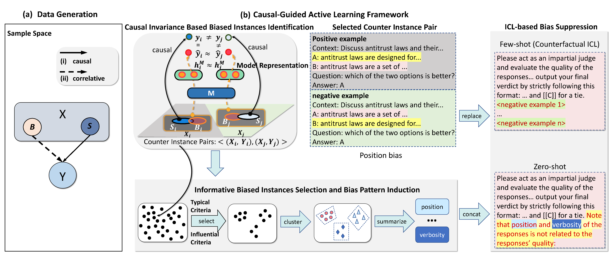

# Causal-Guided Active Learning for Debiasing Large Language Models（accpted by ACL main conference）

<p align="center">
  
</p>

Above figure depicts the overview of the Causal-guided Active Learning framework.

## Dependencies

- Dependencies can be installed using `requirements.txt` and python3.8.

## Quick start for CAL

- Download llama2-13b-chat, vicuna-13b-v1.5 model and put them under ../../model/llama2-13b-chat and ../../model/vicuna-13b-v1.5

- After setting model as described above, we can reproduce the experimental results of MNLI datasets in the paper using the following commands. (For other LLMs and datasets, the commands are similar.)

### Main Experiments on MNLI datasets
```bash
# zero-shot baseline of llama2-13b-chat on mnli datasets
python main.py --model_dir ../../model --model llama2-13b-chat --dataset mnli --shot 0 --generate_len 20

# zero-shot CAL of llama2-13b-chat on mnli datasets
python main.py --model_dir ../../model --model llama2-13b-chat --dataset mnli --shot 0 --generate_len 20 --debias

# few-shot baseline of llama2-13b-chat on mnli datasets
python main.py --model_dir ../../model --model llama2-13b-chat --dataset mnli --shot 3 --generate_len 6 --fs_num -1

# few-shot CAL of llama2-13b-chat on mnli datasets
python main.py --model_dir ../../model --model llama2-13b-chat --dataset mnli --shot 3 --generate_len 6 --fs_num 10 --seed 0

# zero-shot baseline of GPT-4 on mnli datasets
python main.py --model_dir ../../model --model gpt4 --dataset mnli --shot 0 --generate_len 20 

# zero-shot CAL of GPT-4 on mnli datasets
python main.py --model_dir ../../model --model gpt4 --dataset mnli --shot 0 --generate_len 20 --debias
```

If you want to reproduce our biased data identification and bias pattern induction process or find new bias patterns of LLMs, you can install the python package [autobiasdetector](https://pypi.org/project/autobiasdetector/) that we specifically designed for this goal. (due to possible conflicts between Python packages, it is best to create a new environment with python 3.10) The example code for using the package [autobiasdetector](https://pypi.org/project/autobiasdetector/) is located in the biasdetect folder.

Please create an issue or contact me(https://zhouhaosun.github.io/) for any clarifications or suggestions.
